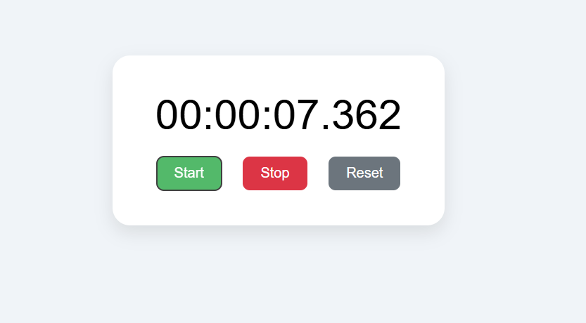

# ⏱️ JavaScript Stopwatch

A clean, responsive, and fully functional stopwatch built with **HTML, CSS, and vanilla JavaScript**. Includes Start, Stop, and Reset buttons, and displays hours, minutes, seconds, and milliseconds with smooth real-time updates.

---

## 🚀 Live Demo

🔗 **Try it live**: [Hosted Stopwatch Demo](https://sarbeswarbhol.github.io/Stopwatch/)  

---

## 📸 Preview

### 🖼️ Screenshot

---

## 🛠️ Features

- ✅ Start, Stop, and Reset functionality
- ✅ Millisecond-precision timing
- ✅ Clean and modern UI
- ✅ Responsive design for mobile and desktop
- ✅ Pure JavaScript implementation (no libraries)
---

## 🧑‍💻 How It Works

- `start()` — Starts the timer if it's not already running.
- `stop()` — Stops the timer and stores elapsed time.
- `reset()` — Stops the timer and resets time to 00:00:00.000.
- Updates every 10 milliseconds using `setInterval()`.

---

## 🔧 Technologies Used

- HTML5
- CSS3 (Flexbox + modern design)
- JavaScript (ES6+)

---
